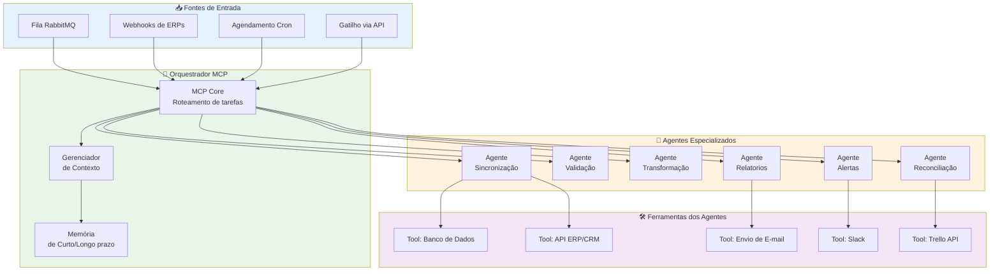
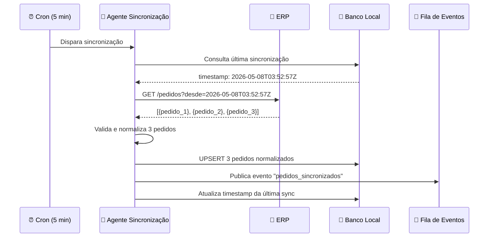
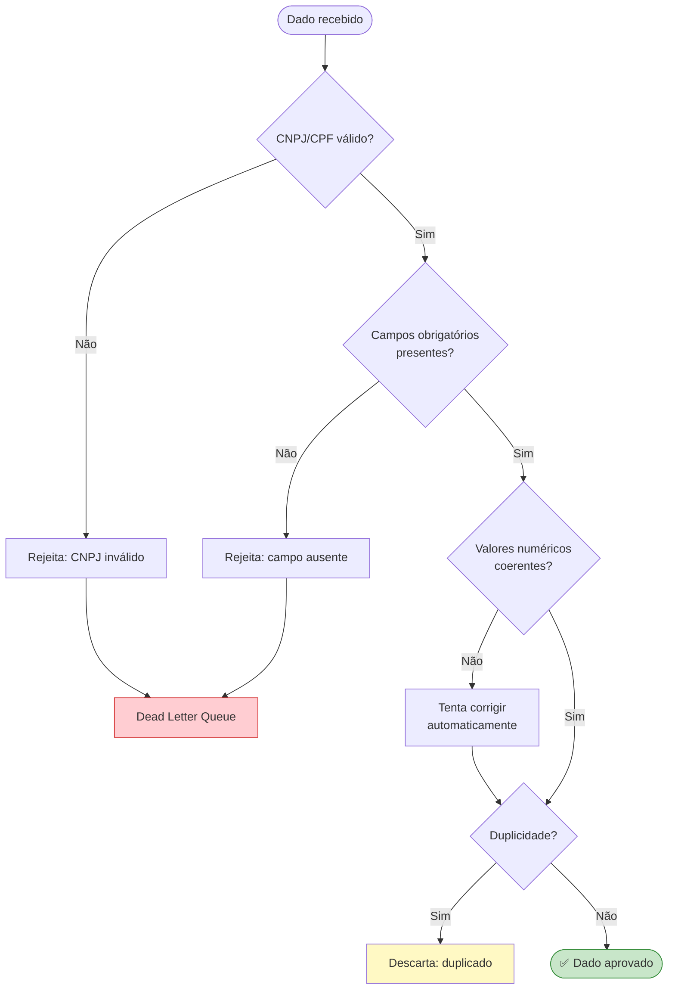
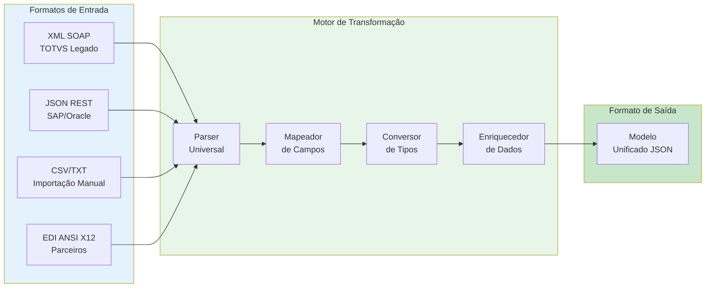
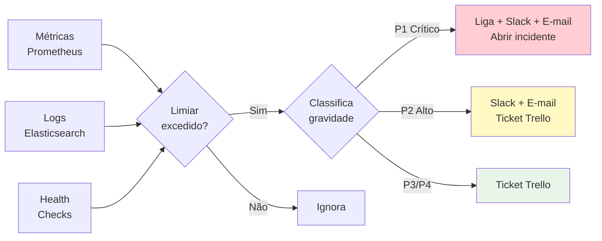
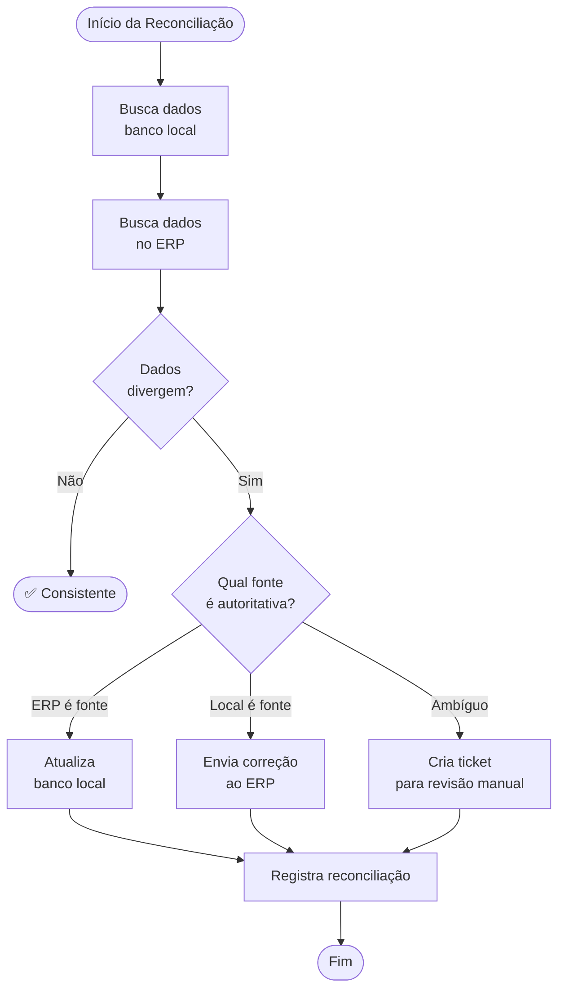
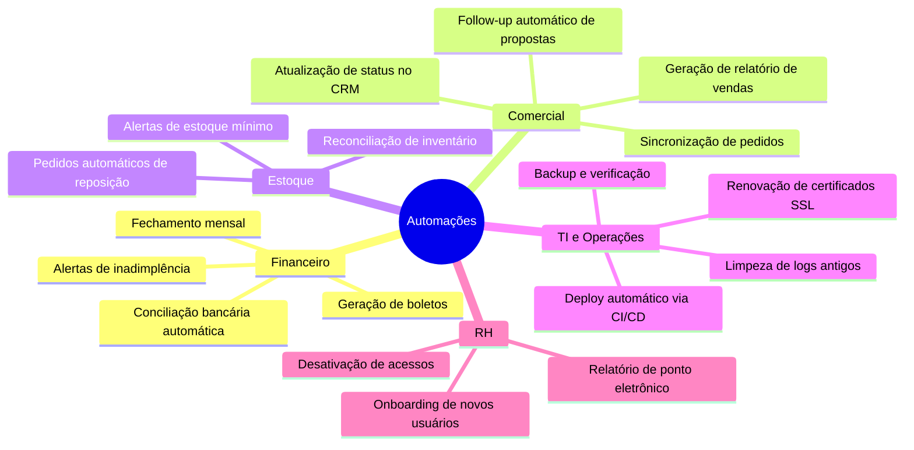

# 🤖 Agentes Inteligentes e Automações

> **Versão:** 1.0.0 · **Módulo:** IA e Automação  
> **Tecnologias:** Python 3.12, MCP Protocol, LangChain, CrewAI

---

## 📋 Sumário

1. [Visão Geral dos Agentes](#visão-geral-dos-agentes)
2. [Catálogo de Agentes](#catálogo-de-agentes)
3. [Fluxo de Decisão dos Agentes](#fluxo-de-decisão-dos-agentes)
4. [Automações Disponíveis](#automações-disponíveis)
5. [Protocolo MCP](#protocolo-mcp)
6. [Configuração dos Agentes](#configuração-dos-agentes)

---

## Visão Geral dos Agentes

Os agentes inteligentes são processos autônomos que **observam → decidem → agem** com base em regras e modelos de linguagem (LLMs). Eles eliminam tarefas repetitivas e padronizáveis do fluxo de trabalho.



---

## Catálogo de Agentes

### 🔄 Agente de Sincronização

**Propósito:** Mantém dados consistentes entre ERP/CRM e o banco local.



| Propriedade | Valor |
|---|---|
| Frequência | A cada 5 minutos (configurável) |
| Timeout máximo | 120 segundos |
| Retry em falha | 3 tentativas com backoff |
| Saída em caso de erro | Dead Letter Queue + alerta Slack |

---

### ✅ Agente de Validação

**Propósito:** Garante a qualidade e integridade dos dados antes da persistência.



**Regras de validação implementadas:**

| Regra | Campo | Ação em caso de falha |
|---|---|---|
| CNPJ/CPF válido | `codigo_cliente` | Rejeição + DLQ |
| Valor > 0 | `valor_total` | Rejeição |
| Data no futuro | `data_entrega` | Alerta (aceita) |
| Duplicidade | `numero_pedido` | Descarte silencioso |
| Moeda suportada | `moeda` | Converte para BRL |

---

### 🔁 Agente de Transformação

**Propósito:** Converte dados entre formatos e estruturas de diferentes sistemas.



---

### 📊 Agente de Relatórios

**Propósito:** Gera relatórios automatizados e os distribui para stakeholders.

**Relatórios disponíveis:**

| Relatório | Frequência | Destinatários | Formato |
|---|---|---|---|
| Resumo de sincronizações | Diário 07:00h | Time de Operações | E-mail HTML |
| Pedidos do dia | Diário 08:00h | Diretoria Comercial | PDF + E-mail |
| Erros de integração | Sob demanda (P1/P2) | Time de Dev | Slack |
| KPIs semanais | Sexta 17:00h | Gestores | Dashboard Grafana |
| Compliance LGPD | Mensal | DPO | PDF |

---

### 🚨 Agente de Alertas

**Propósito:** Monitora indicadores e dispara notificações proativas.



---

### ⚖️ Agente de Reconciliação

**Propósito:** Detecta e corrige inconsistências entre sistemas.



---

## Automações Disponíveis

### Mapa de Automações



### Catálogo de Automações

| # | Automação | Gatilho | Agente | Tempo Economizado |
|---|---|---|---|---|
| A-001 | Sync pedidos ERP→Local | Cron 5min | Sincronização | ~4h/dia |
| A-002 | Validação de cadastros | Evento de novo cliente | Validação | ~2h/dia |
| A-003 | Relatório diário de vendas | Cron 07:00h | Relatórios | ~1h/dia |
| A-004 | Alerta estoque mínimo | Evento de saída de estoque | Alertas | ~30min/dia |
| A-005 | Reconciliação semanal | Cron domingo 01:00h | Reconciliação | ~6h/semana |
| A-006 | Onboarding de usuário | Webhook RH | Validação | ~45min/usuário |
| A-007 | Renovação token OAuth | Cron pré-expiração | Sincronização | Eliminação de erros |

---

## Protocolo MCP

O **Model Context Protocol (MCP)** é o protocolo central que permite aos agentes se comunicarem com ferramentas externas e compartilharem contexto.

```mermaid
graph LR
    subgraph HOST["Host MCP"]
        CLIENTE_MCP[Cliente MCP\n(nossa aplicação)]
    end

    subgraph SERVIDORES["Servidores MCP"]
        SRV_ERP[MCP Server\nERP Tools]
        SRV_DB3[MCP Server\nDatabase Tools]
        SRV_NOTIF[MCP Server\nNotification Tools]
        SRV_FILES[MCP Server\nFile System Tools]
    end

    subgraph TOOLS_MCP["Ferramentas Expostas"]
        T_GET_PEDIDO[get_pedido_erp]
        T_UPDATE_STATUS[update_status_pedido]
        T_SAVE_DB[save_to_database]
        T_QUERY_DB[query_database]
        T_SEND_SLACK[send_slack_message]
        T_SEND_EMAIL[send_email]
    end

    CLIENTE_MCP <-->|JSON-RPC 2.0| SRV_ERP
    CLIENTE_MCP <-->|JSON-RPC 2.0| SRV_DB3
    CLIENTE_MCP <-->|JSON-RPC 2.0| SRV_NOTIF
    CLIENTE_MCP <-->|JSON-RPC 2.0| SRV_FILES

    SRV_ERP --> T_GET_PEDIDO
    SRV_ERP --> T_UPDATE_STATUS
    SRV_DB3 --> T_SAVE_DB
    SRV_DB3 --> T_QUERY_DB
    SRV_NOTIF --> T_SEND_SLACK
    SRV_NOTIF --> T_SEND_EMAIL

    style HOST fill:#e3f2fd
    style SERVIDORES fill:#e8f5e9
    style TOOLS_MCP fill:#fff3e0
```

### Exemplo de Chamada MCP

```json
{
  "jsonrpc": "2.0",
  "id": 1,
  "method": "tools/call",
  "params": {
    "name": "get_pedido_erp",
    "arguments": {
      "sistema_origem": "TOTVS",
      "numero_pedido": "000123",
      "incluir_itens": true
    }
  }
}
```

---

## Configuração dos Agentes

### Variáveis de Ambiente dos Agentes

```env
# Configurações gerais dos agentes
MCP_SERVIDOR_URL=http://mcp-servidor:8000
MCP_TOKEN_ACESSO=seu_token_aqui

# Modelo de linguagem (LLM)
LLM_PROVEDOR=openai
LLM_MODELO=gpt-4o-mini
LLM_CHAVE_API=sk-...

# Agente de Sincronização
SYNC_INTERVALO_MINUTOS=5
SYNC_TAMANHO_LOTE=100
SYNC_TENTATIVAS_MAXIMAS=3

# Agente de Alertas
ALERTA_SLACK_WEBHOOK=https://hooks.slack.com/...
ALERTA_EMAIL_DESTINO=ops@empresa.com
ALERTA_LIMIAR_ERROS=10

# Agente de Relatórios
RELATORIO_EMAIL_SMTP=smtp.empresa.com
RELATORIO_EMAIL_PORTA=587
RELATORIO_EMAIL_USUARIO=relatorios@empresa.com
RELATORIO_EMAIL_SENHA=senha_segura
```
