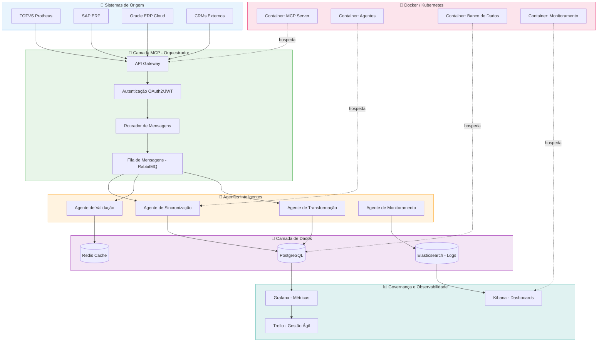
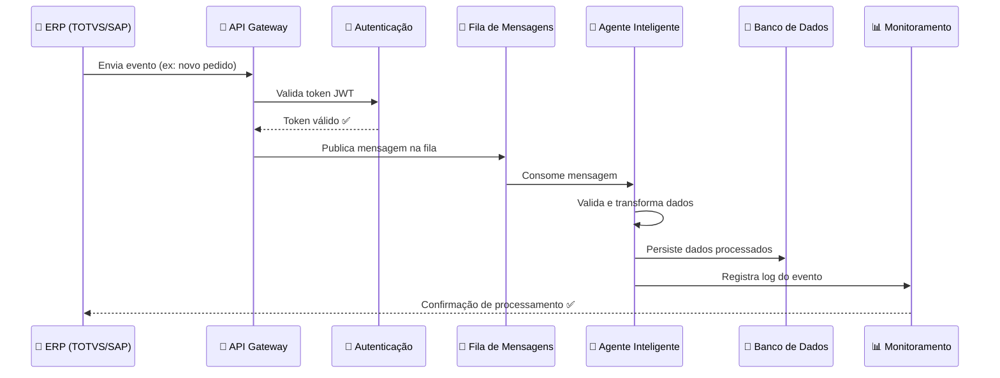
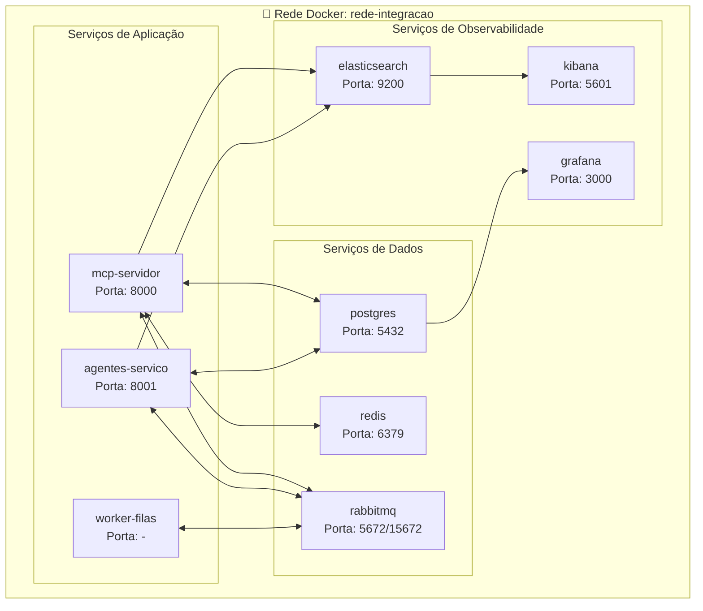
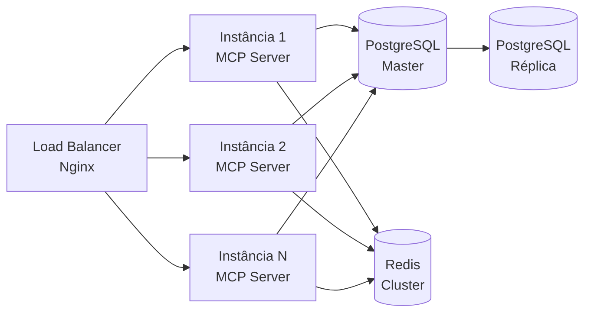

# 🏗️ Arquitetura do Sistema de Integrações ERP/CRM com MCP e Docker

> **Versão:** 1.0.0 · **Data:** 2026-05-08 · **Autor:** Rodrigo Freitas  
> **Status:** Em desenvolvimento

---

## 📋 Sumário

1. [Visão Geral](#visão-geral)
2. [Diagrama de Arquitetura Geral](#diagrama-de-arquitetura-geral)
3. [Componentes Principais](#componentes-principais)
4. [Fluxo de Dados](#fluxo-de-dados)
5. [Camadas da Aplicação](#camadas-da-aplicação)
6. [Infraestrutura com Docker](#infraestrutura-com-docker)
7. [Segurança e Governança](#segurança-e-governança)
8. [Escalabilidade](#escalabilidade)
9. [Tecnologias Utilizadas](#tecnologias-utilizadas)

---

## Visão Geral

O sistema é uma **plataforma de integração inteligente** que conecta ERPs e CRMs corporativos (TOTVS, SAP, Oracle) por meio de uma camada MCP (Model Context Protocol) orquestrada via Docker. Agentes de inteligência artificial automatizam tarefas repetitivas, enquanto pipelines CI/CD garantem entregas contínuas e governança de T.I.

```
┌──────────────────────────────────────────────────────────────────────┐
│                    PLATAFORMA DE INTEGRAÇÃO INTELIGENTE              │
│                                                                      │
│  ┌──────────┐   ┌──────────┐   ┌──────────┐   ┌──────────────────┐ │
│  │  TOTVS   │   │   SAP    │   │  ORACLE  │   │  Outros Sistemas │ │
│  └────┬─────┘   └────┬─────┘   └────┬─────┘   └────────┬─────────┘ │
│       │              │              │                    │           │
│       └──────────────┴──────────────┴────────────────────┘           │
│                              │                                       │
│                    ┌─────────▼─────────┐                            │
│                    │  CAMADA MCP/API   │                            │
│                    │  (Orquestrador)   │                            │
│                    └─────────┬─────────┘                            │
│                              │                                       │
│          ┌───────────────────┼───────────────────┐                  │
│          │                   │                   │                  │
│  ┌───────▼───────┐  ┌────────▼──────┐  ┌────────▼────────┐        │
│  │   Agentes IA  │  │  Automações   │  │  Governança T.I │        │
│  └───────┬───────┘  └────────┬──────┘  └────────┬────────┘        │
│          │                   │                   │                  │
│          └───────────────────┴───────────────────┘                  │
│                              │                                       │
│                    ┌─────────▼─────────┐                            │
│                    │   DOCKER/K8s      │                            │
│                    │  (Infraestrutura) │                            │
│                    └───────────────────┘                            │
└──────────────────────────────────────────────────────────────────────┘
```

---

## Diagrama de Arquitetura Geral



---

## Componentes Principais

### 1. 🔌 Camada MCP (Model Context Protocol)

| Componente | Função | Tecnologia |
|---|---|---|
| API Gateway | Ponto único de entrada de requisições | Kong / Nginx |
| Autenticação | Validação de identidade e permissões | OAuth2 + JWT |
| Roteador | Direciona mensagens ao destino correto | RabbitMQ |
| Transformador | Converte formatos entre sistemas | Python / Jinja2 |

### 2. 🤖 Agentes Inteligentes

| Agente | Responsabilidade |
|---|---|
| `AgenteIntegracao` | Sincroniza dados entre ERP e CRM |
| `AgenteValidacao` | Valida e higieniza dados antes da persistência |
| `AgenteTransformacao` | Mapeia campos e transforma estruturas de dados |
| `AgenteMonitoramento` | Detecta anomalias e gera alertas |

### 3. 🐳 Infraestrutura Docker

Cada serviço roda em container isolado, garantindo:
- **Portabilidade**: funciona igual em qualquer ambiente
- **Isolamento**: falha de um serviço não afeta outros
- **Escalabilidade**: scale horizontal via `docker-compose scale`

---

## Fluxo de Dados



---

## Camadas da Aplicação

```mermaid
graph LR
    subgraph APRESENTACAO["Camada de Apresentação"]
        API_REST[API REST]
        WEBHOOKS[Webhooks]
        SWAGGER[Swagger UI]
    end

    subgraph NEGOCIO["Camada de Negócio"]
        REGRAS[Regras de Negócio]
        VALIDACOES[Validações]
        MAPEAMENTOS[Mapeamentos]
    end

    subgraph INTEGRACAO_CAM["Camada de Integração"]
        CONECTORES[Conectores ERP/CRM]
        ADAPTADORES[Adaptadores de Protocolo]
        TRANSFORMADORES[Transformadores de Dados]
    end

    subgraph PERSISTENCIA["Camada de Persistência"]
        ORM[ORM SQLAlchemy]
        CACHE[Cache Redis]
        MIGRACAO[Migrações Alembic]
    end

    APRESENTACAO --> NEGOCIO
    NEGOCIO --> INTEGRACAO_CAM
    INTEGRACAO_CAM --> PERSISTENCIA

    style APRESENTACAO fill:#e3f2fd
    style NEGOCIO fill:#e8f5e9
    style INTEGRACAO_CAM fill:#fff8e1
    style PERSISTENCIA fill:#fce4ec
```



---

## Infraestrutura com Docker



---

## Segurança e Governança

| Camada | Controle | Ferramenta |
|---|---|---|
| Autenticação | JWT + OAuth 2.0 | Keycloak |
| Autorização | RBAC (por perfil) | Políticas customizadas |
| Secrets | Variáveis de ambiente seguras | Docker Secrets / Vault |
| Auditoria | Log de todas as ações | Elasticsearch |
| Rede | Comunicação criptografada | TLS 1.3 |
| Vulnerabilidades | Scan de imagens Docker | Trivy |

---

## Escalabilidade



**Estratégia de escala:**
- **Horizontal**: adicionar mais containers via `docker-compose scale mcp-servidor=3`
- **Vertical**: ajustar `resources.limits` no `docker-compose.yml`
- **Cache**: Redis reduz carga no banco em até 80%
- **Filas**: RabbitMQ desacopla produtores de consumidores

---

## Tecnologias Utilizadas

| Categoria | Tecnologia | Versão |
|---|---|---|
| Linguagem | Python | 3.12+ |
| Framework API | FastAPI | 0.110+ |
| ORM | SQLAlchemy + Alembic | 2.0+ |
| Banco de Dados | PostgreSQL | 16+ |
| Cache | Redis | 7+ |
| Mensageria | RabbitMQ | 3.13+ |
| Containerização | Docker + Docker Compose | 26+ |
| Orquestrador (prod) | Kubernetes | 1.30+ |
| Logs | Elasticsearch + Kibana | 8+ |
| Métricas | Grafana + Prometheus | 10+ |
| CI/CD | GitHub Actions | - |
| Gestão Ágil | Trello | - |
| Protocolo IA | MCP (Model Context Protocol) | 1.0+ |
