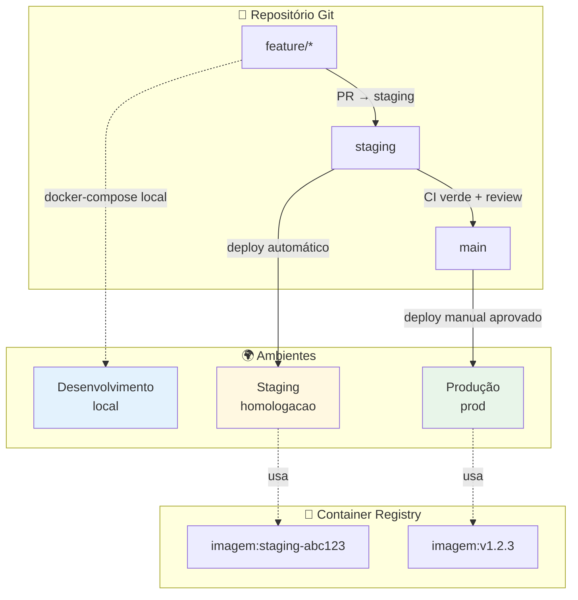
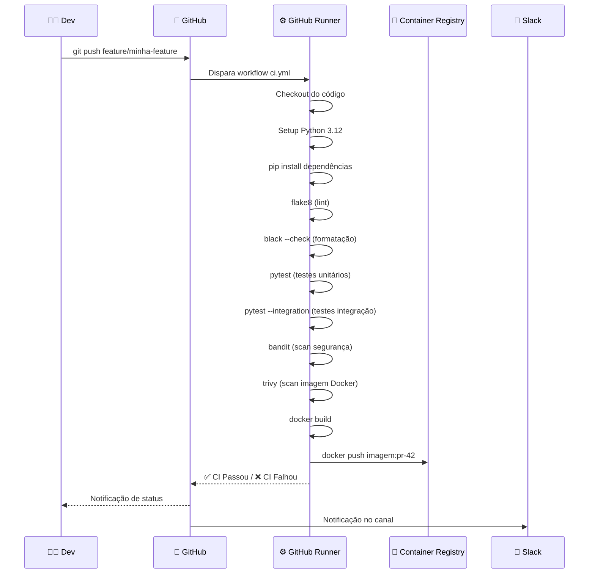
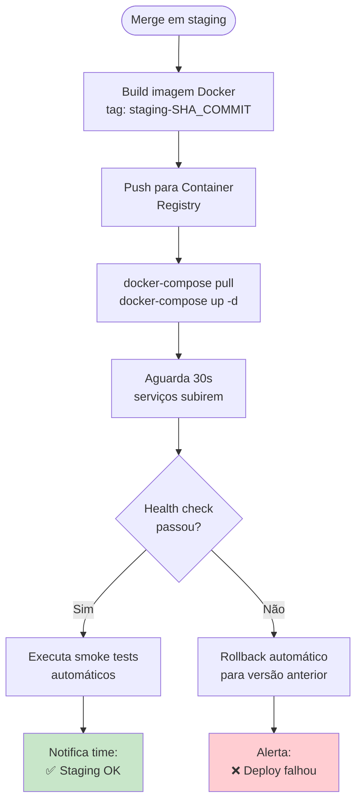
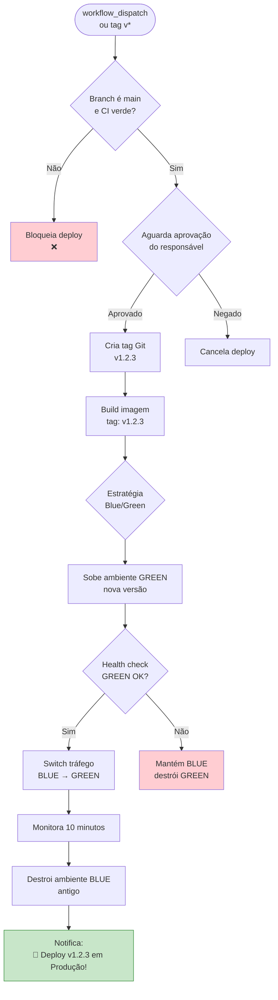
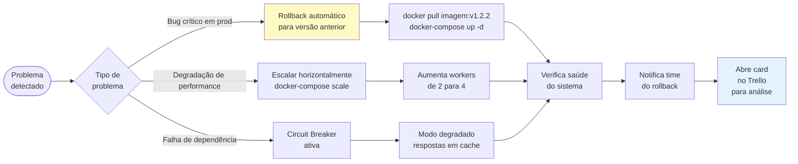
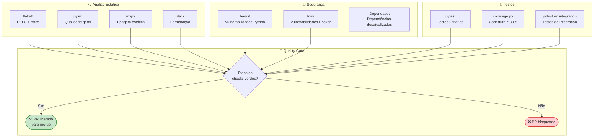

# 🚀 CI/CD e DevOps com GitHub Actions

> **Versão:** 1.0.0 · **Módulo:** Integração e Entrega Contínua  
> **Ferramentas:** GitHub Actions, Docker, Docker Hub / GHCR

---

## 📋 Sumário

1. [Visão Geral do Pipeline](#visão-geral-do-pipeline)
2. [Ambientes e Estratégia de Deploy](#ambientes-e-estratégia-de-deploy)
3. [Pipeline CI — Integração Contínua](#pipeline-ci--integração-contínua)
4. [Pipeline CD — Entrega Contínua](#pipeline-cd--entrega-contínua)
5. [Gestão de Secrets e Variáveis](#gestão-de-secrets-e-variáveis)
6. [Rollback e Recuperação](#rollback-e-recuperação)
7. [Qualidade de Código](#qualidade-de-código)

---

## Visão Geral do Pipeline

```mermaid
flowchart LR
    subgraph DEV_FLOW["👨‍💻 Dev"]
        COMMIT[git commit\ngit push]
        PR[Pull Request\naberto]
    end

    subgraph CI_PIPE["⚙️ CI - Integração Contínua"]
        LINT_CI[1. Lint\n& Formatação]
        TEST_CI[2. Testes\nUnitários]
        TEST_INT[3. Testes de\nIntegração]
        SEC_SCAN[4. Scan de\nSegurança]
        BUILD_IMG[5. Build\nImagem Docker]
    end

    subgraph CD_STAGING["🧪 CD - Staging"]
        PUSH_STG[Push imagem\npara registry]
        DEPLOY_STG[Deploy em\nStaging]
        SMOKE_STG[Smoke Tests\nStaging]
    end

    subgraph APROVACAO["✋ Aprovação"]
        REVIEW[Code Review\n(1 aprovação)]
        QA_OK[QA Aprovado\nno Staging]
    end

    subgraph CD_PROD["🚀 CD - Produção"]
        TAG_RELEASE[Cria tag\nde release]
        DEPLOY_PROD[Deploy em\nProdução]
        HEALTH[Health Check\nPós-deploy]
        NOTIF[Notifica\ntime no Slack]
    end

    COMMIT --> PR
    PR --> LINT_CI --> TEST_CI --> TEST_INT --> SEC_SCAN --> BUILD_IMG
    BUILD_IMG --> PUSH_STG --> DEPLOY_STG --> SMOKE_STG
    SMOKE_STG --> REVIEW
    REVIEW --> QA_OK --> TAG_RELEASE --> DEPLOY_PROD --> HEALTH --> NOTIF

    style CI_PIPE fill:#e3f2fd
    style CD_STAGING fill:#fff8e1
    style APROVACAO fill:#f3e5f5
    style CD_PROD fill:#e8f5e9
```

---

## Ambientes e Estratégia de Deploy



### Matriz de Deploy por Ambiente

| Ambiente | Branch | Trigger | Aprovação necessária | URL |
|---|---|---|---|---|
| Desenvolvimento | `feature/*` | Manual (local) | Nenhuma | `localhost:8000` |
| Staging | `staging` | Automático (push) | CI verde | `staging.empresa.com` |
| Produção | `main` | Manual (workflow_dispatch) | 1 aprovador | `api.empresa.com` |

---

## Pipeline CI — Integração Contínua

### Fluxo Detalhado do CI



---

## Pipeline CD — Entrega Contínua

### Deploy em Staging (automático)



### Deploy em Produção (aprovação manual)



---

## Gestão de Secrets e Variáveis

### Organização dos Secrets no GitHub

```
Repositório GitHub
├── Settings
│   └── Secrets and variables
│       ├── Actions secrets (criptografados)
│       │   ├── POSTGRES_SENHA           # Senha do banco
│       │   ├── REDIS_SENHA              # Senha do Redis
│       │   ├── TOTVS_SENHA              # Credencial TOTVS
│       │   ├── SAP_SENHA                # Credencial SAP
│       │   ├── ORACLE_CLIENTE_SEGREDO   # Segredo OAuth Oracle
│       │   ├── DOCKER_REGISTRY_SENHA    # Senha do registry
│       │   ├── SLACK_WEBHOOK_URL        # Webhook para notificações
│       │   └── LLM_CHAVE_API            # Chave da API do LLM
│       └── Actions variables (não criptografados)
│           ├── AMBIENTE_STAGING=homologacao
│           ├── AMBIENTE_PROD=producao
│           ├── DOCKER_REGISTRY=ghcr.io/org/projeto
│           └── SLACK_CANAL_ALERTAS=#ci-cd
```

### Hierarquia de Prioridade de Variáveis

```
1. Secrets do GitHub Actions (maior prioridade)
2. Variáveis de ambiente do ambiente (staging/prod)
3. Arquivo .env.{ambiente} (não commitado)
4. Arquivo .env.default (valores padrão, commitado)
```

---

## Rollback e Recuperação



### Histórico de Versões para Rollback

| Imagem | Versão | Ambiente | Data | Status |
|---|---|---|---|---|
| `projeto:v1.3.0` | Atual | Produção | 2026-05-08 | 🟢 Ativo |
| `projeto:v1.2.3` | Anterior | Arquivado | 2026-04-20 | 🟡 Disponível |
| `projeto:v1.2.0` | Legado | Arquivado | 2026-03-15 | 🟡 Disponível |
| `projeto:v1.1.0` | Muito antigo | Removido | 2026-02-01 | 🔴 Indisponível |

> **Política de retenção:** últimas 3 versões de produção mantidas no registry

---

## Qualidade de Código

### Ferramentas de Qualidade Integradas ao CI



### Thresholds de Qualidade

| Métrica | Threshold mínimo | Bloqueia PR? |
|---|---|---|
| Cobertura de testes | ≥ 80% | ✅ Sim |
| Score pylint | ≥ 8.0/10 | ✅ Sim |
| Vulnerabilidades críticas (bandit) | 0 | ✅ Sim |
| CVEs críticos (trivy) | 0 | ✅ Sim |
| Erros de formatação (black) | 0 | ✅ Sim |
| Erros de tipo (mypy) | 0 | ✅ Sim |
| Avisos pylint | Sem limite | ❌ Não |
