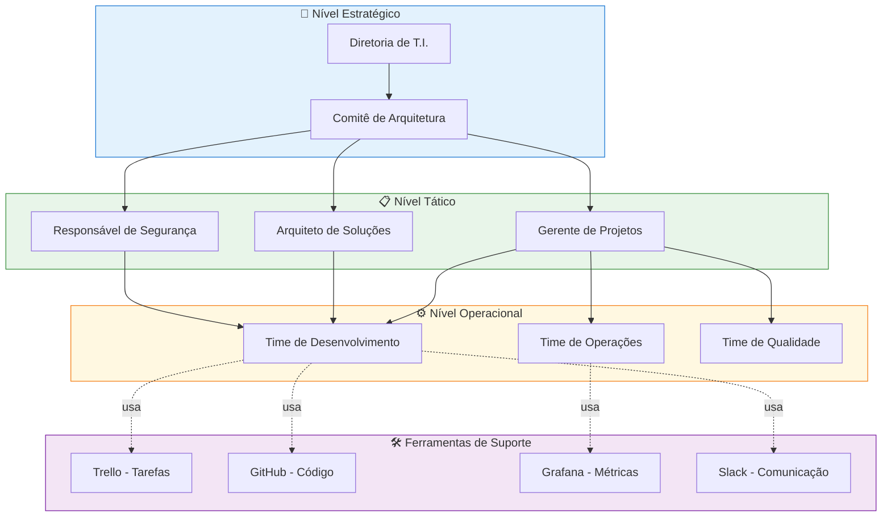
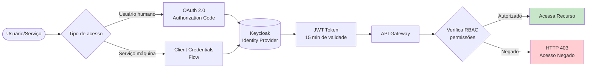
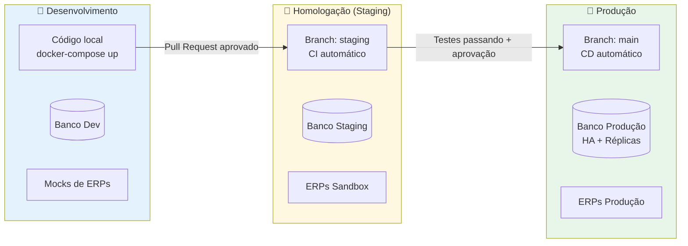
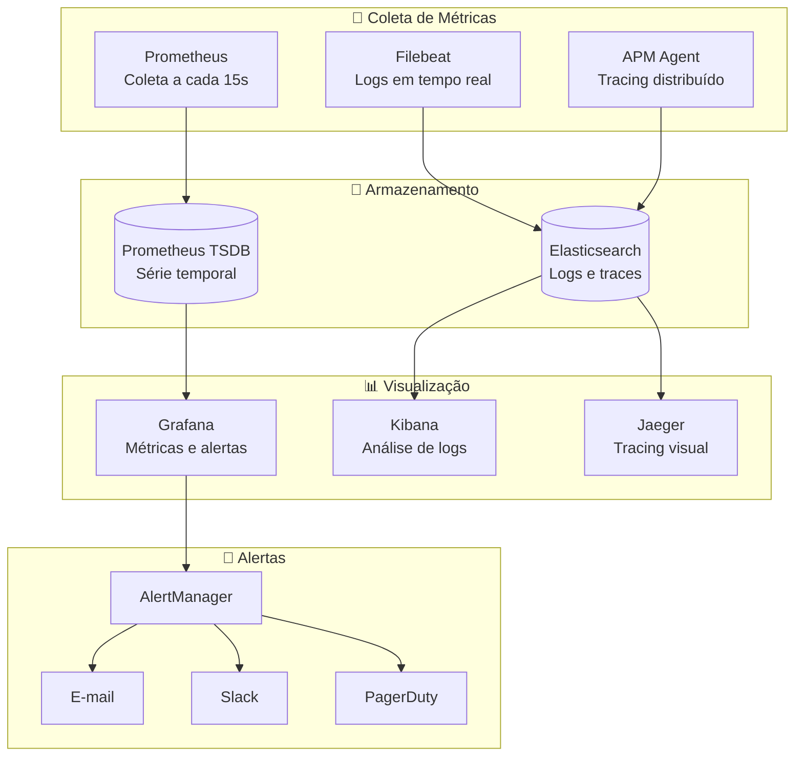
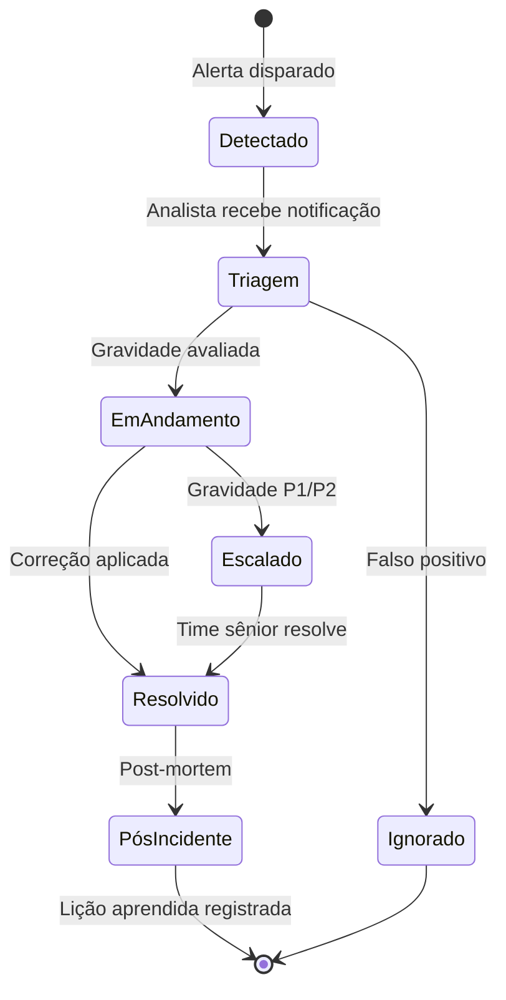

# 📊 Governança de T.I. — Boas Práticas e Escalabilidade

> **Versão:** 1.0.0 · **Módulo:** Governança e Compliance  
> **Frameworks de referência:** ITIL v4, COBIT 2019, ISO 27001

---

## 📋 Sumário

1. [Modelo de Governança](#modelo-de-governança)
2. [Políticas de Segurança](#políticas-de-segurança)
3. [Gestão de Ambientes](#gestão-de-ambientes)
4. [SLAs e Monitoramento](#slas-e-monitoramento)
5. [Gestão de Incidentes](#gestão-de-incidentes)
6. [Controle de Acesso (RBAC)](#controle-de-acesso-rbac)
7. [Backup e Recuperação](#backup-e-recuperação)
8. [Checklist de Boas Práticas](#checklist-de-boas-práticas)

---

## Modelo de Governança



---

## Políticas de Segurança

### Autenticação e Autorização



### Proteção de Dados Sensíveis

| Dado Sensível | Tratamento | Onde Armazenar |
|---|---|---|
| Senhas de APIs | Hash bcrypt + salt | Vault / Docker Secrets |
| Tokens OAuth | Criptografia AES-256 | Redis (TTL curto) |
| Dados pessoais (LGPD) | Pseudonimização | PostgreSQL criptografado |
| Logs de acesso | Retenção 90 dias | Elasticsearch |
| Chaves SSH | Rotação trimestral | GitHub Secrets |

### Política de Senhas de Serviço

```
✅ Mínimo 24 caracteres
✅ Combinação: letras + números + símbolos
✅ Rotação automática a cada 90 dias
✅ Nunca hardcoded no código-fonte
✅ Sempre via variáveis de ambiente ou Vault
❌ Proibido commitar .env com credenciais reais
```

---

## Gestão de Ambientes



### Variáveis por Ambiente

| Variável | Dev | Staging | Produção |
|---|---|---|---|
| `AMBIENTE` | `desenvolvimento` | `homologacao` | `producao` |
| `LOG_NIVEL` | `DEBUG` | `INFO` | `WARNING` |
| `DEBUG_ATIVO` | `true` | `false` | `false` |
| `URL_ERP` | `http://mock:8080` | `https://sandbox.erp` | `https://prod.erp` |
| `WORKERS_QUANTIDADE` | `1` | `2` | `8` |
| `CACHE_TTL_SEGUNDOS` | `60` | `300` | `3600` |

---

## SLAs e Monitoramento

### Metas de SLA

| Serviço | Disponibilidade | Tempo de Resposta | RTO | RPO |
|---|---|---|---|---|
| API Gateway | 99,9% | < 200ms (p95) | 15 min | 5 min |
| Agentes de Integração | 99,5% | < 5s por evento | 30 min | 10 min |
| Banco de Dados | 99,95% | < 50ms (queries) | 10 min | 1 min |
| Painel de Monitoramento | 99% | < 3s | 60 min | N/A |

> **RTO** = Recovery Time Objective (tempo máximo para restaurar o serviço)  
> **RPO** = Recovery Point Objective (máxima perda de dados tolerável)

### Dashboard de Monitoramento



### Métricas Principais (KPIs)

| Métrica | Fórmula | Meta | Alerta |
|---|---|---|---|
| Taxa de sucesso | `(eventos_ok / total_eventos) * 100` | > 99% | < 95% |
| Latência média | `soma_tempos / quantidade_eventos` | < 2s | > 5s |
| Eventos na DLQ | `count(fila_dead_letter)` | 0 | > 10 |
| Uso de CPU | `cpu_utilization` | < 70% | > 85% |
| Uso de memória | `memory_utilization` | < 75% | > 90% |
| Conexões ativas DB | `pg_stat_activity.count` | < 80 | > 95 |

---

## Gestão de Incidentes



### Classificação de Incidentes

| Prioridade | Descrição | Tempo de Resposta | Notificação |
|---|---|---|---|
| **P1 — Crítico** | Sistema fora do ar, perda de dados | 15 minutos | Ligação + Slack + E-mail |
| **P2 — Alto** | Degradação severa de performance | 1 hora | Slack + E-mail |
| **P3 — Médio** | Funcionalidade parcialmente afetada | 4 horas | E-mail |
| **P4 — Baixo** | Impacto mínimo, bug cosmético | 24 horas | Ticket no Trello |

---

## Controle de Acesso (RBAC)

### Perfis e Permissões

| Perfil | Pode Ler | Pode Escrever | Pode Excluir | Admin |
|---|---|---|---|---|
| `admin` | ✅ Tudo | ✅ Tudo | ✅ Tudo | ✅ |
| `desenvolvedor` | ✅ Tudo | ✅ Dev/Staging | ❌ | ❌ |
| `operador` | ✅ Logs/Métricas | ✅ Configs operacionais | ❌ | ❌ |
| `readonly` | ✅ Dashboards | ❌ | ❌ | ❌ |
| `servico_erp` | ✅ Integrações | ✅ Integrações | ❌ | ❌ |

---

## Backup e Recuperação

```mermaid
flowchart LR
    subgraph BACKUP_PROC["🗄️ Processo de Backup"]
        DIARIO[Backup Diário\n02:00h]
        SEMANAL[Backup Semanal\nDomingo 00:00h]
        MENSAL[Backup Mensal\nDia 1 do mês]
    end

    subgraph DESTINO_B["☁️ Destinos"]
        S3[AWS S3\nou equivalente]
        LOCAL[Storage Local\n(redundante)]
    end

    subgraph RETENCAO["📅 Retenção"]
        R1[Diários: 7 dias]
        R2[Semanais: 4 semanas]
        R3[Mensais: 12 meses]
    end

    DIARIO --> S3
    DIARIO --> LOCAL
    SEMANAL --> S3
    MENSAL --> S3

    S3 -.->|política| R1
    S3 -.->|política| R2
    S3 -.->|política| R3
```

---

## Checklist de Boas Práticas

### Desenvolvimento

- [ ] Código revisado por ao menos 1 colega (code review)
- [ ] Testes unitários com cobertura > 80%
- [ ] Sem credenciais hardcoded no repositório
- [ ] Variáveis de ambiente documentadas no `.env.example`
- [ ] Changelog atualizado com cada release
- [ ] Documentação de APIs atualizada (Swagger/OpenAPI)

### Infraestrutura

- [ ] Imagens Docker com versão explícita (não usar `latest`)
- [ ] Health checks configurados em todos os serviços
- [ ] Limites de CPU e memória definidos nos containers
- [ ] Backups testados mensalmente (restore test)
- [ ] Scan de vulnerabilidades nas imagens Docker (Trivy)
- [ ] Logs centralizados no Elasticsearch

### Segurança

- [ ] Secrets gerenciados via Vault ou Docker Secrets
- [ ] TLS habilitado em todas as comunicações
- [ ] Rotação de tokens OAuth configurada
- [ ] LGPD: dados pessoais pseudonimizados
- [ ] Auditoria de acessos habilitada
- [ ] Penetration test semestral
