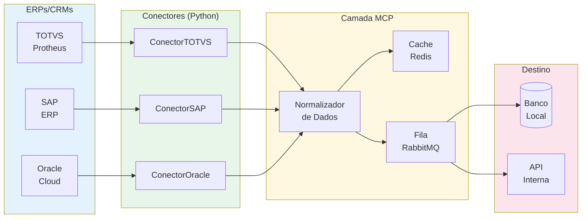
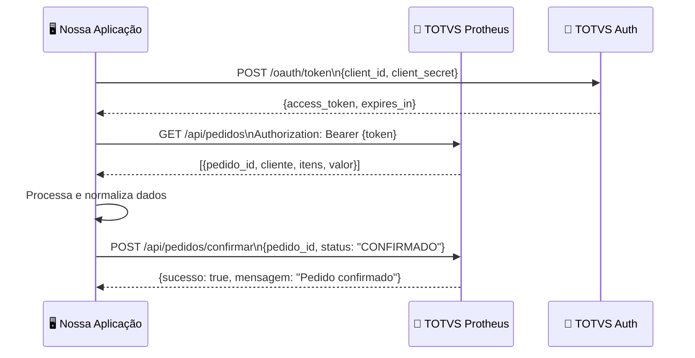
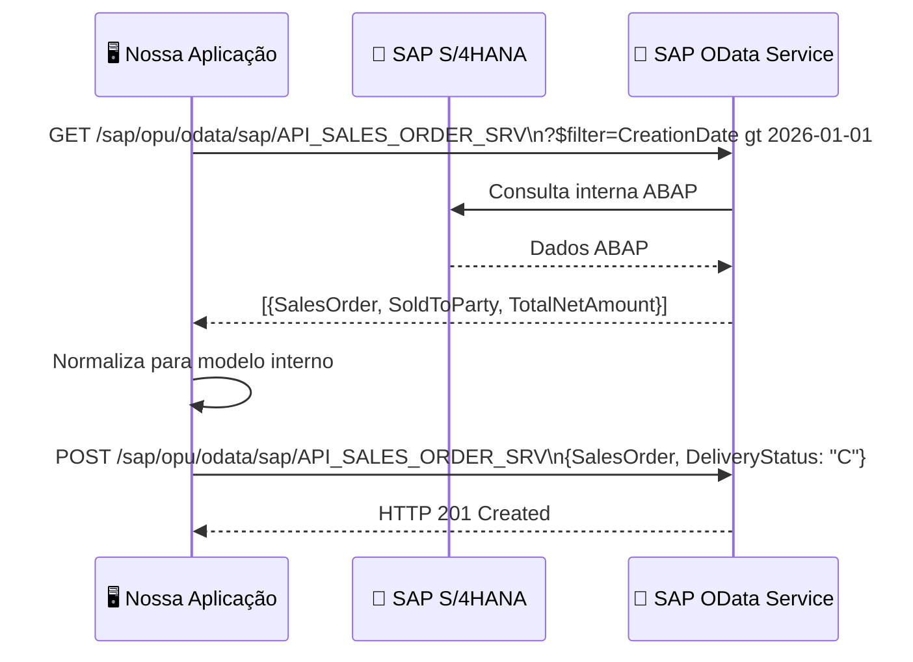
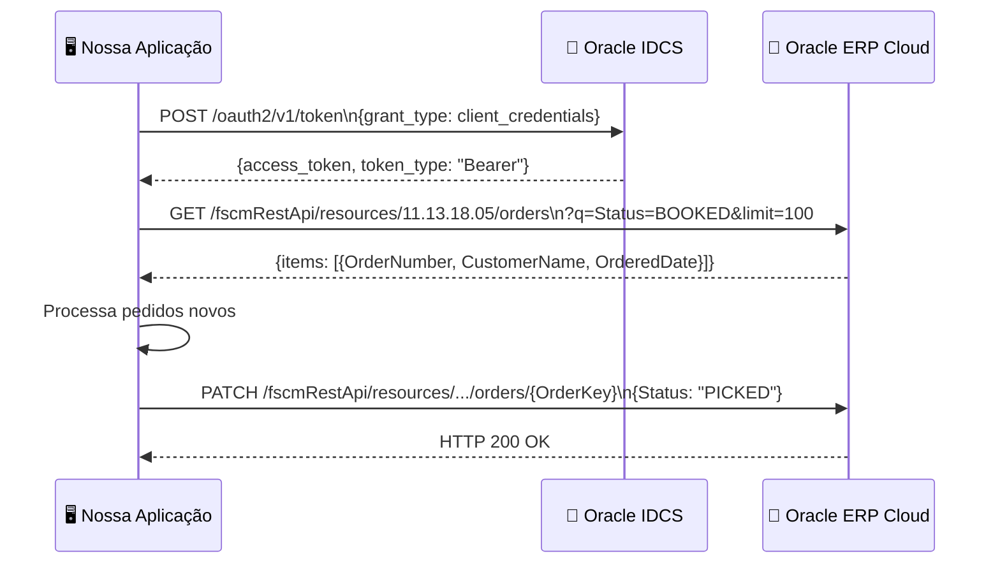
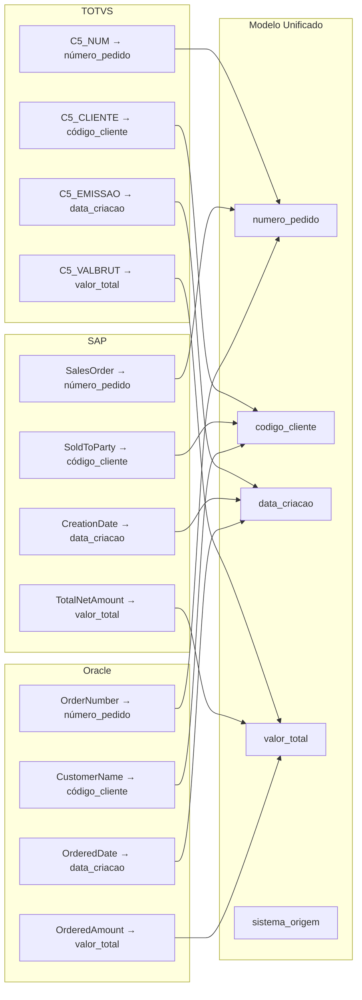
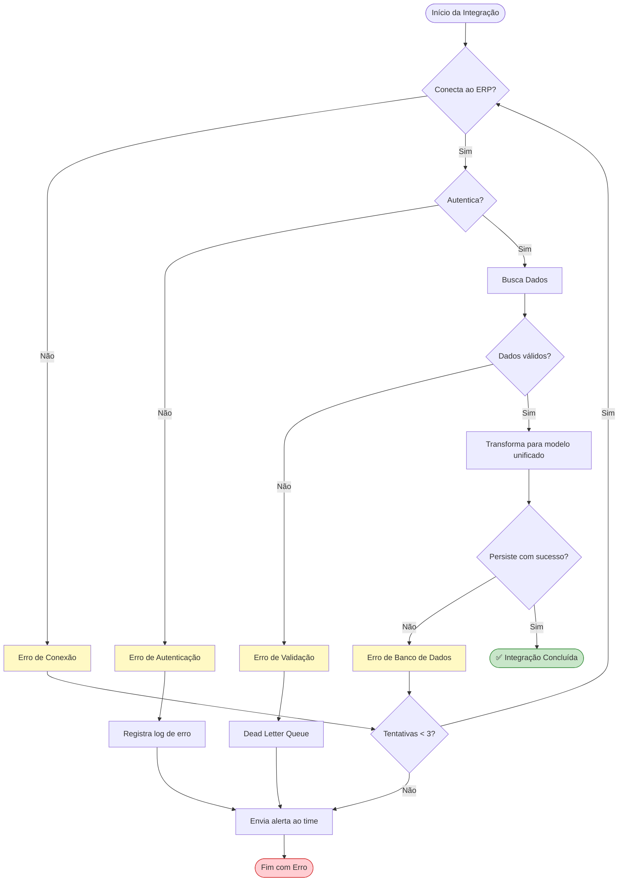

# 🔌 Documentação de Integração com ERPs e CRMs

> **Versão:** 1.0.0 · **Módulo:** Conectores de Integração  
> **Sistemas suportados:** TOTVS Protheus, SAP ERP, Oracle ERP Cloud

---

## 📋 Sumário

1. [Visão Geral das Integrações](#visão-geral-das-integrações)
2. [TOTVS Protheus](#totvs-protheus)
3. [SAP ERP](#sap-erp)
4. [Oracle ERP Cloud](#oracle-erp-cloud)
5. [Mapeamento de Campos](#mapeamento-de-campos)
6. [Tratamento de Erros](#tratamento-de-erros)
7. [Exemplos de Payload](#exemplos-de-payload)

---

## Visão Geral das Integrações



---

## TOTVS Protheus

### Protocolo de Comunicação

O TOTVS Protheus expõe dados via **REST API** (TOTVS Fluig / TOTVS Carol) ou **Web Services SOAP** (versões legadas).



### Endpoints Principais (TOTVS)

| Recurso | Método | URL | Descrição |
|---|---|---|---|
| Pedidos | GET | `/api/pedidos` | Lista pedidos |
| Pedido por ID | GET | `/api/pedidos/{id}` | Detalha pedido |
| Clientes | GET | `/api/clientes` | Lista clientes |
| Produtos | GET | `/api/produtos` | Catálogo de produtos |
| Nota Fiscal | POST | `/api/nf-saida` | Emite NF-e |
| Estoque | GET | `/api/estoque/{produto_id}` | Consulta estoque |

### Configuração (`.env`)

```env
# Credenciais TOTVS
TOTVS_URL_BASE=https://seu-servidor-totvs:8080
TOTVS_USUARIO=usuario_integracao
TOTVS_SENHA=senha_segura
TOTVS_EMPRESA=01
TOTVS_FILIAL=0101
TOTVS_TIMEOUT_SEGUNDOS=30
```

---

## SAP ERP

### Protocolo de Comunicação

O SAP utiliza **OData v4** (SAP S/4HANA) ou **RFC/BAPI** via biblioteca `pyrfc`.



### Endpoints OData Principais (SAP)

| Serviço OData | Entidade | Uso |
|---|---|---|
| `API_SALES_ORDER_SRV` | `A_SalesOrder` | Pedidos de venda |
| `API_CUSTOMER_SRV` | `A_Customer` | Cadastro de clientes |
| `API_MATERIAL_SRV` | `A_Product` | Produtos e materiais |
| `API_FINANCIAL_DOCUMENT_SRV` | `A_FinancialDocument` | Documentos financeiros |
| `API_PURCHASEORDER_PROCESS_SRV` | `A_PurchaseOrder` | Ordens de compra |

### Configuração (`.env`)

```env
# Credenciais SAP
SAP_URL_BASE=https://seu-servidor-sap
SAP_USUARIO=svc_integracao
SAP_SENHA=senha_segura
SAP_CLIENTE=100
SAP_MANDANTE=800
SAP_TIMEOUT_SEGUNDOS=60
SAP_VERSAO_ODATA=v4
```

---

## Oracle ERP Cloud

### Protocolo de Comunicação

Oracle ERP Cloud utiliza **REST API** com autenticação **Basic Auth** ou **OAuth 2.0 (IDCS)**.



### Endpoints REST Principais (Oracle)

| Recurso | Método | URL | Descrição |
|---|---|---|---|
| Pedidos | GET | `/fscmRestApi/resources/.../orders` | Lista pedidos |
| Clientes | GET | `/crmRestApi/resources/.../accounts` | Contas/clientes |
| Oportunidades | GET | `/crmRestApi/resources/.../opportunities` | Pipeline comercial |
| Faturas | GET | `/fscmRestApi/resources/.../invoices` | Faturas a receber |
| Fornecedores | GET | `/fscmRestApi/resources/.../suppliers` | Cadastro fornecedores |

### Configuração (`.env`)

```env
# Credenciais Oracle ERP Cloud
ORACLE_URL_BASE=https://seu-tenant.oraclecloud.com
ORACLE_CLIENTE_ID=seu_client_id
ORACLE_CLIENTE_SEGREDO=seu_client_secret
ORACLE_URL_IDCS=https://idcs-xxx.identity.oraclecloud.com
ORACLE_TIMEOUT_SEGUNDOS=45
```

---

## Mapeamento de Campos

### Pedido de Venda — Modelo Unificado



### Tabela de Mapeamento Completa

| Campo Unificado | TOTVS | SAP OData | Oracle REST | Tipo |
|---|---|---|---|---|
| `numero_pedido` | `C5_NUM` | `SalesOrder` | `OrderNumber` | `str` |
| `codigo_cliente` | `C5_CLIENTE` | `SoldToParty` | `CustomerAccountNumber` | `str` |
| `nome_cliente` | `A1_NOME` | `SoldToPartyName` | `CustomerName` | `str` |
| `data_criacao` | `C5_EMISSAO` | `CreationDate` | `OrderedDate` | `date` |
| `data_entrega` | `C5_ENTREG` | `RequestedDeliveryDate` | `RequestedShipDate` | `date` |
| `valor_total` | `C5_VALBRUT` | `TotalNetAmount` | `OrderedAmount` | `decimal` |
| `moeda` | `C5_MOEDA` | `TransactionCurrency` | `TransactionCurrencyCode` | `str` |
| `status_pedido` | `C5_STATUS` | `OverallDeliveryStatus` | `StatusCode` | `str` |
| `sistema_origem` | `"TOTVS"` | `"SAP"` | `"ORACLE"` | `str` |

---

## Tratamento de Erros



### Códigos de Erro Padronizados

| Código | Descrição | Ação |
|---|---|---|
| `INT-001` | Timeout de conexão | Retry automático (3x) |
| `INT-002` | Token expirado | Renovação automática |
| `INT-003` | Dados inválidos | Envio para DLQ + alerta |
| `INT-004` | Limite de requisições (rate limit) | Backoff exponencial |
| `INT-005` | Serviço indisponível | Alerta + circuit breaker |
| `INT-006` | Erro de mapeamento de campo | Log detalhado + DLQ |

---

## Exemplos de Payload

### Entrada — Pedido TOTVS (raw)

```json
{
  "C5_NUM": "000123",
  "C5_CLIENTE": "CLI001",
  "A1_NOME": "Empresa ABC Ltda",
  "C5_EMISSAO": "20260508",
  "C5_ENTREG": "20260515",
  "C5_VALBRUT": 15000.00,
  "C5_MOEDA": "BRL",
  "C5_STATUS": "L",
  "itens": [
    {"C6_PRODUTO": "PROD001", "C6_QTDVEN": 10, "C6_PRCVEN": 1500.00}
  ]
}
```

### Saída — Modelo Unificado (normalizado)

```json
{
  "numero_pedido": "000123",
  "codigo_cliente": "CLI001",
  "nome_cliente": "Empresa ABC Ltda",
  "data_criacao": "2026-05-08",
  "data_entrega": "2026-05-15",
  "valor_total": 15000.00,
  "moeda": "BRL",
  "status_pedido": "LIBERADO",
  "sistema_origem": "TOTVS",
  "data_processamento": "2026-05-08T03:57:57Z",
  "itens": [
    {
      "codigo_produto": "PROD001",
      "quantidade": 10,
      "preco_unitario": 1500.00,
      "valor_item": 15000.00
    }
  ]
}
```
