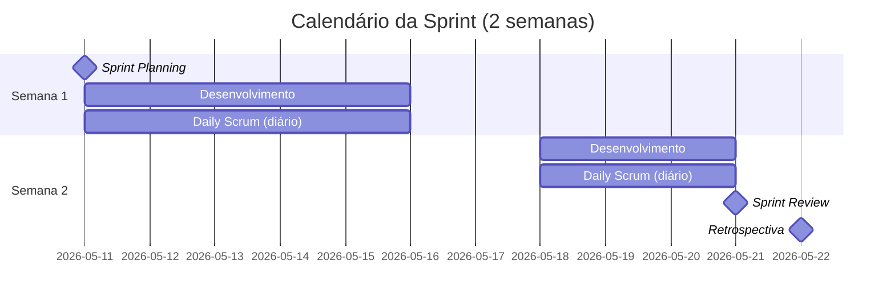
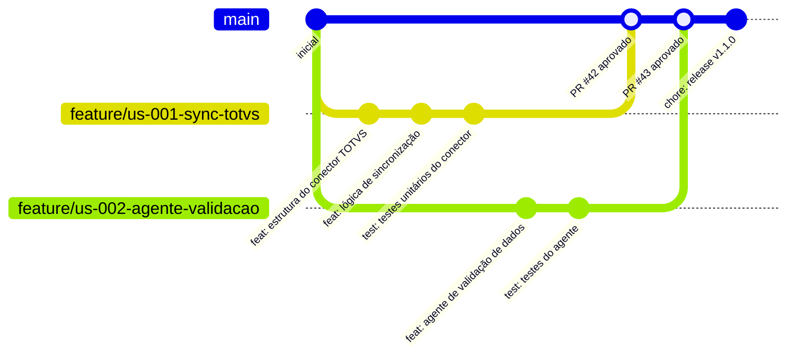
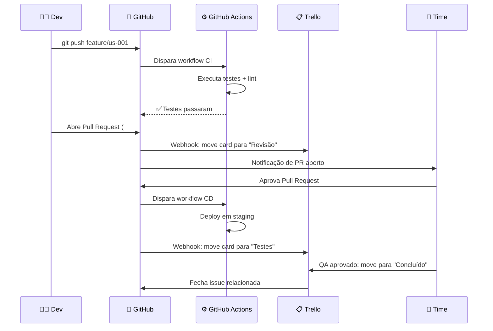
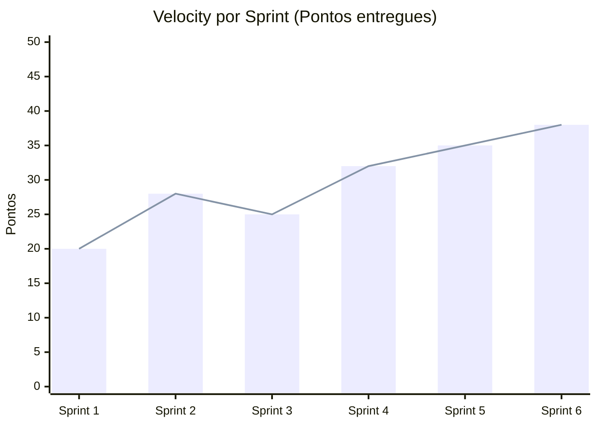

# 📋 Metodologia Ágil com Trello e GitHub

> **Versão:** 1.0.0 · **Módulo:** Gestão de Projetos  
> **Metodologia:** Scrum + Kanban híbrido

---

## 📋 Sumário

1. [Visão Geral do Processo](#visão-geral-do-processo)
2. [Estrutura do Trello](#estrutura-do-trello)
3. [Cerimônias Ágeis](#cerimônias-ágeis)
4. [Fluxo de Desenvolvimento](#fluxo-de-desenvolvimento)
5. [Integração Trello + GitHub](#integração-trello--github)
6. [Definição de Pronto (DoD)](#definição-de-pronto-dod)
7. [Métricas de Agilidade](#métricas-de-agilidade)

---

## Visão Geral do Processo

```mermaid
graph LR
    subgraph DESCOBERTA["🔍 Descoberta"]
        REQUISITO[Requisito\nidentificado]
        REFINAMENTO[Refinamento\ncom time]
        ESTIMATIVA[Estimativa\nde esforço]
    end

    subgraph PLANEJAMENTO["📋 Planejamento"]
        BACKLOG[Product\nBacklog]
        SPRINT_PLAN[Sprint\nPlanning]
        SPRINT_BACK[Sprint\nBacklog]
    end

    subgraph EXECUCAO["⚙️ Execução"]
        DEV_TASK[Desenvolvimento]
        CODE_REVIEW2[Code Review]
        TESTE[Testes QA]
    end

    subgraph ENTREGA["🚀 Entrega"]
        HOMOLOGACAO[Homologação]
        RELEASE[Release /\nDeploy]
        RETRO[Retrospectiva]
    end

    REQUISITO --> REFINAMENTO --> ESTIMATIVA
    ESTIMATIVA --> BACKLOG --> SPRINT_PLAN --> SPRINT_BACK
    SPRINT_BACK --> DEV_TASK --> CODE_REVIEW2 --> TESTE
    TESTE --> HOMOLOGACAO --> RELEASE --> RETRO
    RETRO -.->|Melhoria contínua| BACKLOG

    style DESCOBERTA fill:#e3f2fd
    style PLANEJAMENTO fill:#e8f5e9
    style EXECUCAO fill:#fff8e1
    style ENTREGA fill:#f3e5f5
```



---

## Estrutura do Trello

### Quadro Principal: "🏗️ Sistema de Integrações ERP/CRM"

```
┌──────────────┬──────────────┬──────────────┬──────────────┬──────────────┬──────────────┐
│  📥 BACKLOG  │  🗂️ SPRINT   │  🔧 EM ANDAMENTO │ 👀 REVISÃO  │  🧪 TESTES  │  ✅ CONCLUÍDO │
│              │              │              │              │              │              │
│  Histórias   │  Itens da    │  Tarefas que │  Aguardando  │  Em fase de  │  Entregues   │
│  do produto  │  sprint      │  estão sendo │  code review │  teste QA    │  com sucesso │
│  priorizadas │  atual       │  desenvolvidas│              │              │              │
│              │              │              │              │              │              │
│  [US-001]    │  [US-003]    │  [US-005]    │  [US-007]    │  [US-009]    │  [US-011]    │
│  [US-002]    │  [US-004]    │  [US-006]    │  [US-008]    │  [US-010]    │  [US-012]    │
└──────────────┴──────────────┴──────────────┴──────────────┴──────────────┴──────────────┘
```

### Etiquetas (Labels) do Trello

| Etiqueta | Cor | Uso |
|---|---|---|
| `Feature` | 🟢 Verde | Nova funcionalidade |
| `Bug` | 🔴 Vermelho | Correção de defeito |
| `Melhoria` | 🔵 Azul | Refatoração ou melhoria |
| `Urgente` | 🟠 Laranja | Alta prioridade |
| `Integração ERP` | 🟡 Amarelo | Relacionado a ERPs |
| `Infraestrutura` | 🟣 Roxo | Docker, CI/CD, infra |
| `Documentação` | ⚪ Branco | Docs e evidências |
| `Bloqueado` | ⚫ Preto | Aguardando dependência |

### Modelo de Card do Trello

```markdown
## [US-001] Sincronizar pedidos do TOTVS

**Descrição:**
Como operador de integração, quero que os pedidos do TOTVS sejam 
sincronizados automaticamente a cada 5 minutos, para que o banco 
local fique sempre atualizado.

**Critérios de Aceitação:**
- [ ] Pedidos novos são importados em até 5 minutos
- [ ] Pedidos atualizados refletem as mudanças do ERP
- [ ] Erros de sync são logados e alertados
- [ ] Sincronização idempotente (sem duplicatas)

**Estimativa:** 5 pontos de história
**Sprint:** Sprint 2
**Responsável:** @dev-fulano
**Etiquetas:** Feature, Integração ERP

**Links:**
- Branch: `feature/us-001-sync-totvs`
- PR: https://github.com/org/repo/pull/42
- Evidência de teste: [link para screenshot]
```

---

## Cerimônias Ágeis



### Guia das Cerimônias

| Cerimônia | Frequência | Duração | Participantes | Objetivo |
|---|---|---|---|---|
| **Daily Scrum** | Diária 09:00h | 15 min | Time de dev | Sincronizar progresso e bloqueios |
| **Sprint Planning** | Início da sprint | 2 horas | Todo o time | Selecionar e planejar itens da sprint |
| **Sprint Review** | Fim da sprint | 1 hora | Time + Stakeholders | Demonstrar o que foi entregue |
| **Retrospectiva** | Fim da sprint | 1 hora | Time de dev | Identificar melhorias no processo |
| **Refinamento** | Meio da sprint | 1 hora | PO + Time | Detalhar próximos itens do backlog |

---

## Fluxo de Desenvolvimento



### Convenção de Branches

| Prefixo | Uso | Exemplo |
|---|---|---|
| `feature/` | Nova funcionalidade | `feature/us-001-sync-totvs` |
| `fix/` | Correção de bug | `fix/bug-timeout-sap` |
| `hotfix/` | Correção urgente em prod | `hotfix/token-expirado` |
| `refactor/` | Refatoração sem nova feature | `refactor/conector-oracle` |
| `docs/` | Documentação apenas | `docs/arquitetura-v2` |
| `chore/` | Tarefas técnicas | `chore/atualiza-dependencias` |
| `staging` | Ambiente de homologação | (branch protegida) |
| `main` | Produção | (branch protegida) |

### Convenção de Commits (Conventional Commits)

```
<tipo>(<escopo>): <descrição curta em pt-br>

[corpo opcional]

[rodapé opcional: refs #ticket]
```

**Tipos:**

| Tipo | Quando usar |
|---|---|
| `feat` | Nova funcionalidade |
| `fix` | Correção de bug |
| `docs` | Documentação |
| `test` | Adição/correção de testes |
| `refactor` | Refatoração de código |
| `chore` | Tarefas de manutenção |
| `ci` | Mudanças no CI/CD |
| `perf` | Melhoria de performance |

**Exemplos:**
```
feat(totvs): adiciona sincronização de pedidos via cron

Implementa o agente de sincronização que busca pedidos novos
a cada 5 minutos usando o endpoint /api/pedidos com filtro
de data desde a última execução.

refs #US-001
```

---

## Integração Trello + GitHub



### Automações Trello ↔ GitHub

| Evento GitHub | Ação no Trello |
|---|---|
| Branch criada com `feature/us-XXX` | Move card para "Em Andamento" |
| Pull Request aberto | Move card para "Revisão" |
| PR aprovado + CI verde | Move card para "Testes" |
| PR mergeado | Move card para "Concluído" |
| Issue fechada | Arquiva card no Trello |

---

## Definição de Pronto (DoD)

Um item é considerado **Pronto** quando **todos** os critérios abaixo são atendidos:

### ✅ Checklist de Pronto

**Desenvolvimento:**
- [ ] Código implementado e funcionando conforme critérios de aceitação
- [ ] Código revisado por ao menos 1 colega (code review aprovado)
- [ ] Sem conflitos com a branch `main`
- [ ] Variáveis e comentários em português (pt-br)
- [ ] Sem credenciais hardcoded

**Qualidade:**
- [ ] Testes unitários escritos (cobertura ≥ 80%)
- [ ] Testes de integração executados e passando
- [ ] Lint sem erros (`flake8` / `pylint`)
- [ ] Sem regressões em funcionalidades existentes

**Documentação:**
- [ ] Docstrings em português em funções/classes públicas
- [ ] README atualizado se necessário
- [ ] Swagger/OpenAPI atualizado para novos endpoints
- [ ] Card do Trello atualizado com evidências

**Deploy:**
- [ ] Deploy realizado em staging com sucesso
- [ ] Testes de fumaça (smoke tests) passando em staging
- [ ] Monitoramento configurado para nova funcionalidade

---

## Métricas de Agilidade

### Velocity da Sprint



### Métricas Acompanhadas

| Métrica | Descrição | Meta | Frequência |
|---|---|---|---|
| **Velocity** | Pontos entregues por sprint | Crescimento 5%/sprint | Sprint |
| **Lead Time** | Tempo do backlog ao deploy | < 10 dias | Contínuo |
| **Cycle Time** | Tempo de "Em Andamento" ao deploy | < 3 dias | Contínuo |
| **CFD** | Cumulative Flow Diagram | Sem acúmulo | Semanal |
| **Taxa de Bugs** | Bugs abertos / features entregues | < 0,2 | Sprint |
| **Dívida Técnica** | % do backlog de refatorações | < 20% | Mensal |
